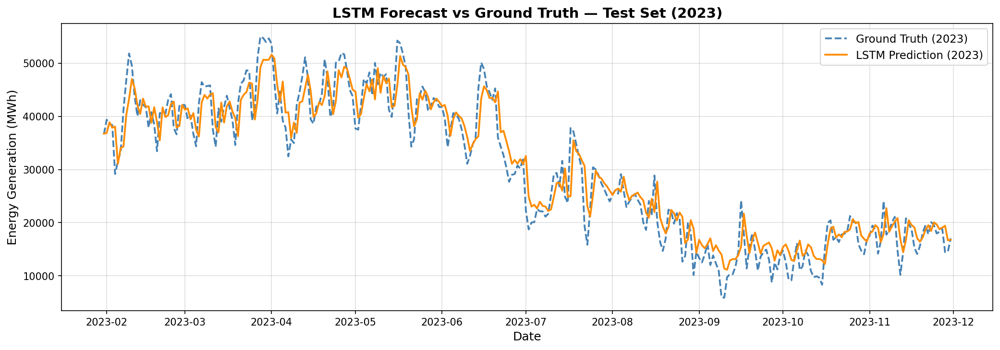
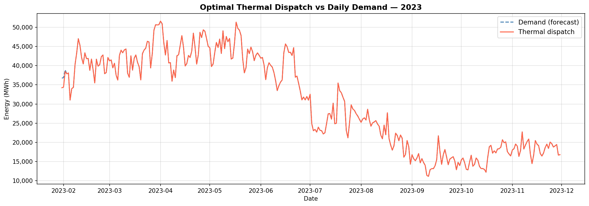

# Reproducible Code — Energy Generation Forecasting & Dispatch Optimization

Companion code for the paper published in *Energy Conversion and Management*:

> **Forecast-informed daily energy dispatch for cost and emission reduction: Evidence from an emerging economy power system**
> Felipe Carrasco, Fredy Kristjanpoller, Ignacio Verdugo, Pablo Viveros, Rodrigo Pascual
> *Energy Conversion and Management*, 2026.
> DOI: [10.1016/j.enconman.2026.121611](https://doi.org/10.1016/j.enconman.2026.121611)

This repository provides a self-contained single-region case study for the **Valparaíso region** of Chile, demonstrating the two-stage pipeline described in the paper:

1. **Stage 1 — LSTM forecasting** (`Forecast_total_generation.ipynb`): daily electricity generation prediction
2. **Stage 2 — Multi-objective LP dispatch** (`Modelation_linear_programming.ipynb`): cost and CO₂ emissions minimization using the LSTM forecasts as the demand signal

---

## Repository Structure

```
upon_acceptance_code/
├── Forecast_total_generation.ipynb       # Stage 1 — LSTM training and evaluation
├── Modelation_linear_programming.ipynb   # Stage 2 — LP dispatch optimization
├── data/
│   ├── generacion_total.parquet          # Raw generation data (142.6 MB, stored in Git LFS)
│   └── predictions_valparaiso_2023.parquet  # Pre-computed LSTM forecasts (Git LFS)
├── models/
│   └── lstm_valparaiso.pt                # Best LSTM checkpoint (generated by Stage 1)
├── figures/
│   ├── 01_generation_time_series.png
│   ├── 02_learning_curves.png
│   ├── 03_forecast_vs_truth.png
│   ├── 04_error_distribution.png
│   ├── 05_residuals_vs_truth.png
│   ├── 06_error_over_time.png
│   ├── 07_residual_acf_pacf.png
│   ├── 08_daily_demand.png
│   ├── 09_thermal_dispatch.png
│   └── 10_daily_cost.png
├── requirements.txt
├── LICENSE
├── CITATION.cff
└── README.md
```

---

## Setup

Python 3.10+ is required.

```bash
pip install -r requirements.txt
```

---

## Data

Both dataset files are included in this repository via **Git LFS** and are downloaded automatically with `git clone`.

| File | Size | Notes |
|---|---|---|
| `data/generacion_total.parquet` | 142.6 MB | Hourly generation records for all Chilean plants (2000–2023), sourced from [energiaabierta.cl](https://energiaabierta.cl/) (CNE) |
| `data/predictions_valparaiso_2023.parquet` | — | Pre-computed LSTM forecasts for 2023; Stage 2 can be run from this file alone |

> **Git LFS required:** If you downloaded the repo as a ZIP (without `git clone`), the `.parquet` files will be LFS pointer stubs. Clone the repo with `git clone` to get the actual data, or install [Git LFS](https://git-lfs.com/) and run `git lfs pull`.

---

## How to Run

Run the notebooks **in order** (or run Stage 2 standalone):

### Stage 1: Forecast (`Forecast_total_generation.ipynb`)

- Filters Valparaíso region data and aggregates to daily totals
- **Normalization:** Min-Max scaling to [0, 1], scaler fitted on training split only (2016–2021) to prevent data leakage
- **Look-back window:** 30 days
- **Hyperparameter search:** Optuna Bayesian (TPE), 50 trials, 40 epochs per trial (search is commented out — takes ~30 min on CPU; best parameters are hardcoded)
- **Training:** up to 200 epochs with early stopping (patience = 20); best checkpoint saved to `models/lstm_valparaiso.pt`
- Saves predictions to `data/predictions_valparaiso_2023.parquet`
- Saves all figures to `figures/` (01–07)

### Stage 2: LP Optimization (`Modelation_linear_programming.ipynb`)

- Loads LSTM forecasts as daily demand signal
- Solves multi-objective LP: min α·cost + β·emissions (α = 0.9, β = 0.1) using PuLP / CBC
- **Dispatchable resources:** thermal plant, BESS
- **BESS parameters:** 10,000 MWh capacity, 2,500 MWh/day max charge/discharge, η = 0.92, S₀ = 5,000 MWh (50%)
- Saves figures to `figures/` (08–10)

---

## Key Results (Valparaíso, 2023 test set)

| Metric | Value |
|---|---|
| Forecast RMSE | 3,626.8 MWh |
| Forecast MAE | ~2,740 MWh |
| Forecast MAPE | 10.98 % |
| Optimization periods | 304 days |
| Solver | PuLP / CBC (open-source) |
| Objective weights | α = 0.9 (cost), β = 0.1 (emissions) |
| Total operational cost | USD 935,223,361 |
| Total CO₂e emissions | 8,416,423,294 kg |

> **Paper-level aggregate results** (generation-weighted, all 14 regions): 21.7% cost reduction, 42.5% CO₂ reduction, 22.9% thermal generation reduction relative to baseline scheduling.

---

## Reproducibility

**Stage 2 (LP)** is fully deterministic: given the same predictions file, the CBC solver produces identical output on any platform.

**Stage 1 (LSTM)** results may vary slightly when re-run due to stochastic LSTM initialization, even with fixed seeds (`SEED = 42`). This arises from non-deterministic floating-point ordering across CPU/GPU backends and PyTorch versions. Re-produced RMSE values within ± 5 % of 3,626.8 MWh are consistent with normal stochastic variation. See Section 8 of `Forecast_total_generation.ipynb` for a detailed explanation.

The pre-computed `data/predictions_valparaiso_2023.parquet` file is included so Stage 2 can be reproduced exactly without re-running Stage 1.

---

## Selected Figures

> Figures are generated automatically when the notebooks are executed and saved to the `figures/` folder (Stage 1 → 01–07, Stage 2 → 08–10).

### LSTM Forecast vs Ground Truth (2023)


### Optimal Thermal Dispatch (2023)


---

## Citation

If you use this code, please cite:

```bibtex
@article{carrasco2026forecast,
  author  = {Carrasco, Felipe and Kristjanpoller, Fredy and Verdugo, Ignacio
             and Viveros, Pablo and Pascual, Rodrigo},
  title   = {Forecast-informed daily energy dispatch for cost and emission reduction:
             Evidence from an emerging economy power system},
  journal = {Energy Conversion and Management},
  year    = {2026},
  doi     = {10.1016/j.enconman.2026.121611}
}
```
